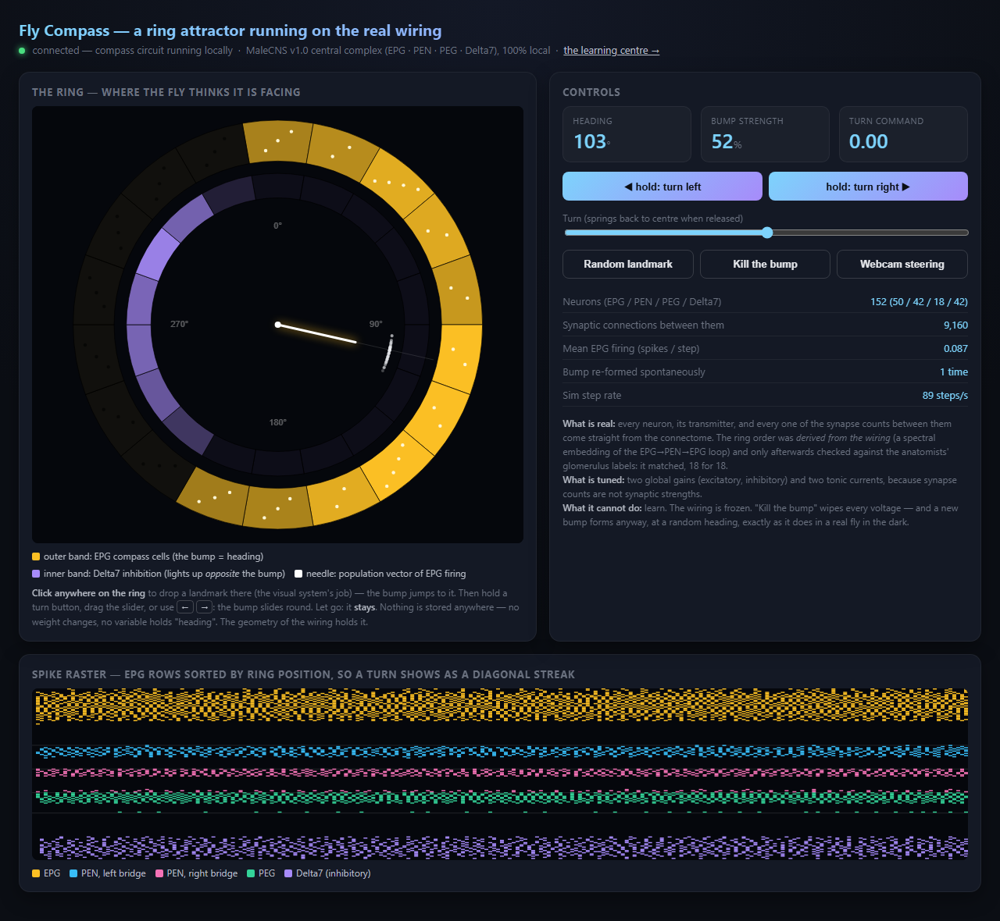
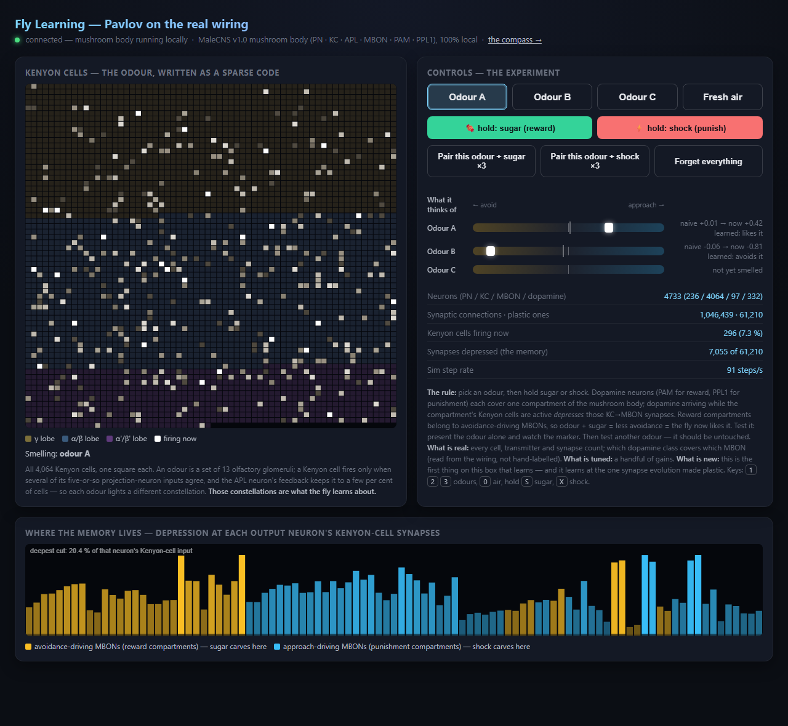

# Fly Brain — a dead insect's sense of self, running on a PC

One male fruit fly. Killed, fixed in resin, sliced into thousands of
sections, photographed under an electron microscope, every neuron and
every synapse traced. The animal is gone. Its wiring diagram — the
complete **MaleCNS v1.0** central nervous system, 166,700 neurons,
released in September 2026 by HHMI Janelia FlyEM, the University of
Cambridge, MRC LMB and Google Research — is a public file.

This repository downloads that file and switches two of its circuits
back on, as spiking simulations, in plain Python, on a CPU:

- **The compass.** 152 neurons that tell a fly which way it is facing.
  A bump of activity sits on a ring of cells; the bump *is* the heading.
  Steer it with your hand, let go, and it holds — for as long as you
  care to watch. Nothing is stored. No weight changes. No variable holds
  "heading". The wiring's geometry holds it. **Memory without learning.**
- **The learning centre.** 4,733 neurons of the mushroom body, with the
  one synapse type the animal makes plastic. Show it an odour, give it
  sugar, and it comes to like that odour; shock it on another and it
  comes to avoid that one — specific, reversible, forgettable.
  **Pavlov, on the original hardware.**

The fly is dead. Its sense of which way it's facing is not. That first
circuit is the most literal "sense of self" biology has — a first-person
coordinate, the origin of the animal's map — and here it is, rebooted
without the animal, orienting to a webcam on a desk in the north of
England. Make of that what you will; we're still making of it what we can.

<p align="center">
  
  
</p>

**What is real:** every neuron, its transmitter, every synapse count
between them, the ring order, which dopamine neurons teach which output
neurons. **What is ours:** cartoon neuron dynamics (leaky
integrate-and-fire), a handful of gains, and the modelling choices
listed under each circuit below. Say all of it in any write-up — the
honest part is what makes the miraculous part believable.

**Everything runs on your own machine.** The only network call in this
entire project is the one-time data download. After that nothing talks
to anything but your own browser.

## Run it

```bash
python -m venv .venv && .venv\Scripts\activate      # Windows; on mac/linux: source .venv/bin/activate
pip install -r requirements.txt

python scripts/01_download_data.py                 # ~560 MB, once, from the official Janelia bucket
python scripts/03_build_compass.py                 # cuts the compass circuit out, ~2 s
python scripts/05_build_mushroom_body.py           # cuts the learning centre out, ~5 s

python server/sim_server.py --mode compass                 # http://localhost:8765/
python server/sim_server.py --mode mushroom --port 8766    # http://localhost:8766/
```

On Windows, `start_fly_brain.bat` starts both and opens the compass.
Python 3.10+, numpy, scipy, pandas, pyarrow, aiohttp, requests. No GPU.

## The compass — a ring attractor on the real wiring

`scripts/03_build_compass.py` pulls the head-direction circuit out of the
connectome: 50 EPG compass cells, 42 PEN, 18 PEG and 42 Delta7 neurons,
9,160 synaptic connections between them. Each cell's place on the ring
is *derived from the wiring* — a spectral embedding of the EPG→PEN→EPG
loop — and only afterwards checked against the anatomists' glomerulus
labels in the annotation file. It matches, 18 wedges for 18.

`server/compass_sim.py` runs it as a leaky integrate-and-fire network:
local excitation along the ring, Delta7 inhibition that lands on the
far side of the ring from wherever the bump is, and the two bridge
halves' PEN neurons pushing the bump left or right when they are driven
unequally. Turning is a gain modulation of those PENs. That is the
mechanism found in living flies (Seelig & Jayaraman 2015; Kim et al.
2017) and in the central-complex connectome (Hulse et al. 2021), and
first shown to emerge from a spiking model of the bridge by Kakaria & de
Bivort (2017).

What you can do on the page: click the ring to drop a landmark (the
visual system's job in the animal) and the bump jumps there; hold a turn
button, drag the spring-loaded slider, use the arrow keys, or let the
webcam steer it (motion on the right of the picture turns right); "Kill
the bump" wipes every voltage and a new bump forms anyway, at a random
heading, the way it does in a real fly in the dark. The raster below the
ring lists the compass cells in ring order, so a turn shows as a
diagonal streak.

Measured on the live server, six random seeds: holds a heading for 30
seconds and more with zero input, turns at about 108°/s at full command
(a lap in ~3.3 s), never dies at full turn, re-forms in under a second.

Modelling choices, so nobody has to rediscover them: turning must be a
*gain* modulation of the PENs (an added current fattens or starves the
bump, and it collapses when released); the cells need a 6-step synaptic
time constant and a 20 % spread of thresholds (identical cells fire in
lock-step, all go refractory together, and the ring dies); the recurrent
gain has a narrow window (too low and the bump dies, too high and it
pins to a wedge and refuses to turn); and each wedge's cell count is
equalised (this fly has 2, 3 or 4 EPGs per wedge, and the bump slides
toward the loud ones otherwise). Gains live in `data/compass/params.json`,
found by `scripts/04_tune_compass.py --robust`.

Two honest artefacts: the 18-wedge ring pins like a lattice, so pushes
below ~40 % of full scale do not move the bump at all (the page lifts
small commands over that dead zone); and one fly's wiring has favourite
headings that the bump drifts toward over ten seconds or so. A real fly
has visual and self-motion inputs anchoring it; this one has you.

## The learning centre — Pavlov in the mushroom body

`scripts/05_build_mushroom_body.py` pulls out the mushroom body with its
inputs and its teachers: 236 uniglomerular projection neurons carrying
51 olfactory glomeruli, all 4,064 Kenyon cells, the APL feedback neuron,
97 output neurons (MBONs), and 332 dopamine neurons — 316 PAM, which
signal reward, and 16 PPL1, which signal punishment. 1,046,439 synaptic
connections.

`server/mushroom_sim.py` runs it with exactly one plastic synapse type:
Kenyon cell → MBON. When dopamine arrives in a compartment while the
Kenyon cells feeding it are active, those synapses are depressed. That
is the three-factor rule the animal uses (Aso et al. 2014; Hige et al.
2015; Handler et al. 2019). Reward dopamine neurons cover the
compartments whose MBONs drive *avoidance*, so odour + sugar = less
avoidance = the fly now approaches that odour; punishment neurons cover
the approach compartments and do the mirror image. Which MBON is which
is not hand-labelled: it is read off the connectome as whichever
dopamine class sends it more synapses.

An odour is a fixed set of 13 glomeruli. The page shows all 4,064
Kenyon cells as a 64×64 grid; each odour lights a different sparse
constellation (4–7 % of cells, overlap between odours near chance), and
those constellations are what the fly learns about. Pick an odour, hold
sugar or shock — or use the "pair ×3" buttons — then present the odour
alone and watch its marker; present another and watch it stay put.
Measured on the live server: odour A −0.04 → +0.47 after three sugar
pairings, odour B untouched, then B → −0.85 after three shocks with A
retained; 61,210 plastic synapses; 0.3 ms per step (1.4 ms while
learning). The memory decays over minutes, or "Forget everything" wipes
it. The bottom panel shows where the memory physically lives: sugar
carves the avoidance-driving MBONs, shock carves the approach-driving ones.

Modelling choices: glomeruli are equalised (this fly's PN→KC synapse
counts vary 30× between glomeruli, so odours would differ in strength by
accident); the Kenyon cells' contacts onto each other (58 % of their
synapses by count, axo-axonal, in the lobes) carry no fast current, or
they drown the odour signal five to one; dopamine synapses carry no fast
current either — they are the teaching signal; and the APL feedback
needs a large gain to enforce sparsity at 5 % activity. Gains live in
`data/mushroom/params.json`.

## Layout

```
scripts/01_download_data.py      the three release files, once, resumable
scripts/03_build_compass.py      compass circuit + ring angles  -> data/compass/
scripts/04_tune_compass.py       gain search; --robust runs six seeds at full turn
scripts/05_build_mushroom_body.py learning circuit + MBON valence -> data/mushroom/
scripts/probe_*.py               diagnostics: circuit census, connection kernels vs angle,
                                 population traces, the Pavlov protocol, live WebSocket tests
scripts/screenshot.py            headless-Chrome screenshot of a live page (waits for the WebSocket)
scripts/send.py                  send one JSON command to a live server
server/compass_sim.py            the compass simulator
server/mushroom_sim.py           the learning-centre simulator
server/sim_server.py             aiohttp server: page + /neurons + /ws, one mode per process
dashboard/compass.html           the ring, the needle, the raster
dashboard/mushroom.html          the Kenyon-cell grid, the odour bench, the memory trace
tests/                           pytest on tiny synthetic circuits (no download needed)
data/*/params.json               the tuned gains (everything else in data/ is built or fetched)
```

`python -m pytest` runs the tests; they need no data.

## Where next

A virtual MIDI port so the compass needle drives a synth (an LFO with
memory). A whole-brain experiment mode: all 166,700 neurons, activate the
sugar-taste neurons, list which motor neurons answer — the Shiu et al.
(2024) experiment on a desktop. Ring neurons and their inhibitory Hebbian
plasticity so the compass anchors to a webcam landmark and learns the
room. A reservoir-computing readout that uses the frozen wiring as a
feature extractor for real signals. A real retina — webcam → T4/T5 motion
detectors → optic-flow cells → the compass — which is a research project,
because direction selectivity does not fall out of a plain LIF without
tuned time constants.

## Credits and licences

Data: MaleCNS v1.0, CC-BY 4.0 — see `DATA_LICENSE.md`. Code: MIT, see
`LICENSE`. Background reading: Seelig & Jayaraman 2015; Kim et al. 2017;
Hulse et al. 2021; Kakaria & de Bivort 2017; Aso et al. 2014; Hige et al.
2015; Handler et al. 2019; Shiu et al. 2024.
